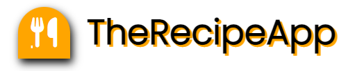

<a name="readme-top"></a>

<div align="center">
  
  <br/>

  <h3><b>Recipe-App</b></h3>

</div>

# 📗 Table of Contents

- [📖 About the Project](#about-project)
  - [🛠 Built With](#built-with)
    - [Tech Stack](#tech-stack)
    - [Key Features](#key-features)
  - [🚀 Live Demo](#live-demo)
- [💻 Getting Started](#getting-started)
  - [Setup](#setup)
  - [Prerequisites](#prerequisites)
  - [Install](#install)
  - [Usage](#usage)
  - [Run tests](#run-tests)
  - [Deployment](#triangular_flag_on_post-deployment)
- [👥 Authors](#authors)
- [🔭 Future Features](#future-features)
- [🤝 Contributing](#contributing)
- [⭐️ Show your support](#support)
- [🙏 Acknowledgements](#acknowledgements)
- [📝 License](#license)

# 📖 Recipe-App <a name="about-project"></a>

**Recipe-App** is a website that displays meals categorized into 3 groups. Each meal has cooking instructions, comments, likes and additional information (incl video).

## 🛠 Built With <a name="built-with"></a>
- JavaScript
- Webpack
- Jest
- HTML/CSS

### Key Features <a name="key-features"></a>


- **Save data to Involvement API service**
- **Retrieve from Involvement API service**
- **Retrieve data from mealsDB API**

<p align="right">(<a href="#readme-top">back to top</a>)</p>

## 🚀 Live Demo <a name="live-demo"></a>

- [Live Demo Link](https://yourdeployedapplicationlink.com) currently unavailable.

<p align="right">(<a href="#readme-top">back to top</a>)</p>

## 💻 Getting Started <a name="getting-started"></a>

To get a local copy up and running, follow these steps.

### Prerequisites

In order to run this project you need:

- Node.js & npm
- A web browser


### Setup

Navigate to your desired folder and enter these commands:


```sh
  git clone git@github.com:myaccount/recipe-app.git
  cd recipe-app
```


### Install

Install all dependencies with:

```sh
  npm i
```


### Usage

To run the project, execute the following command:

```sh
  npm start
```

<p align="right">(<a href="#readme-top">back to top</a>)</p>

## 👥 Author <a name="authors"></a>

👤 **Karan Jain**
- GitHub: [@karanj2212](https://github.com/karanJ2212)
- LinkedIn: [@karanjain2212](https:/www.linkedin.com/in/karanjain2212/)

👤 **Botlhale Setou**
- GitHub: [@Botlhale-Setou](https://github.com/Botlhale-Setou)
- LinkedIn: [@botlhalesetou](https://www.linkedin.com/in/botlhalesetou/)
- Twitter: [@Botlhale_Setou](https://twitter.com/Botlhale_Setou)


<p align="right">(<a href="#readme-top">back to top</a>)</p>

## 🔭 Future Features <a name="future-features"></a>

- [ ] **UI Improvement**
- [ ] **Mobile version**

<p align="right">(<a href="#readme-top">back to top</a>)</p>

## 🤝 Contributing <a name="contributing"></a>

Contributions, issues, and feature requests are welcome!

Feel free to check the [issues page](https://github.com/Botlhale-Setou/recipe-app/issues).

<p align="right">(<a href="#readme-top">back to top</a>)</p>

## ⭐️ Show your support <a name="support"></a>

If you like this project, please give it a star ⭐

<p align="right">(<a href="#readme-top">back to top</a>)</p>

## 🙏 Acknowledgments <a name="acknowledgements"></a>
Special thanks to all the assistance received!

<p align="right">(<a href="#readme-top">back to top</a>)</p>

## 📝 License <a name="license"></a>

This project is [MIT](./LICENSE) licensed.

<p align="right">(<a href="#readme-top">back to top</a>)</p>
